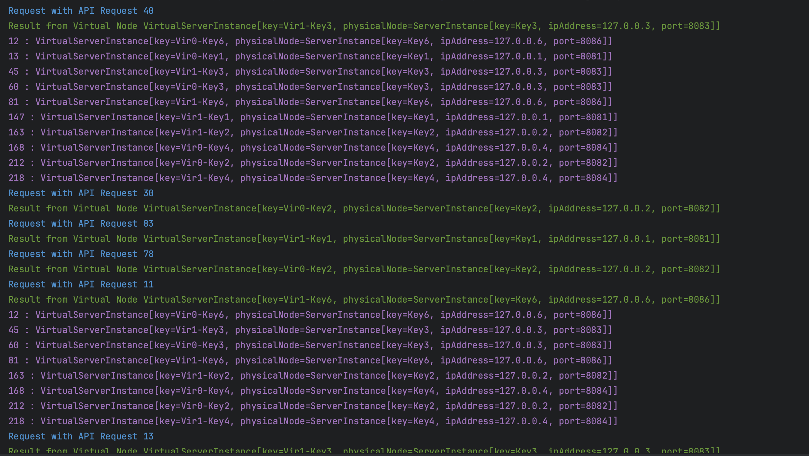

# Distributed Consistent Hashing with Virtual Nodes

This project implements distributed consistent hashing with virtual nodes in Java.   
The consistent hashing algorithm ensures a balanced distribution of keys across a dynamic set of nodes, improving load balancing and fault tolerance.

### Implementation
* Simulate Scaling Up and Down of instance
* Load balancing API request to instance from the Ring

